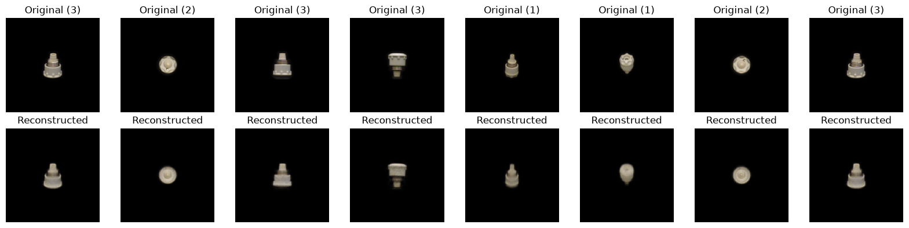

# Industrial VAE


[](https://opensource.org/licenses/MIT)
[](https://www.python.org/downloads/)
[](https://pytorch.org/)

Industrial VAE is an exploratory computer-vision project for learning compact representations of industrial imagery with a convolutional variational autoencoder (VAE). The current work focuses on reconstructing object images from the T-LESS dataset and studying how much useful visual information can be retained in a regularized latent space.




This repository is related to my research at the Paul Scherrer Institute (PSI). It is intended for training and visualization of VAEs.

## Project goals

- Train a VAE on images of texture-less industrial objects.
- Compare original images with their reconstructions.
- Explore compact latent representations for visualization and future downstream tasks.
- Build toward anomaly detection, synthetic data generation, and representation learning for industrial applications.

## Datasets

### T-LESS

The VAE is trained on the BOP-format T-LESS training dataset. T-LESS contains RGB images of texture-less rigid objects, making it useful for industrial computer-vision research where geometry and shape are often more informative than surface texture.

The notebook currently:

- uses objects `01`, `02`, and `03`;
- reads PNG images from each object's `rgb` directory;
- converts every image to RGB;
- resizes images to `128 × 128` pixels; and
- converts pixel values to PyTorch tensors in the range `[0, 1]`.

Dataset files are not committed to this repository. 

The T-LESS dataset is distributed separately and remains subject to its own terms and citation requirements.

### Synthetic occupancy maps

The notebook also contains an early data-generation experiment for binary occupancy maps. Each `64 × 64` map contains outer walls and a random set of rectangular obstacles. These maps are useful for testing visualization and representation-learning ideas, but the current RGB VAE training loop uses T-LESS images.

## How the VAE works

A variational autoencoder learns to reconstruct an input while organizing its compressed representation into a smooth probabilistic latent space.

```text
RGB image
  [3, 128, 128]
        │
        ▼
Convolutional encoder
        │
        ├──► latent mean (μ) ──┐
        │                      ├──► sampled latent vector z
        └──► latent log-variance ┘
                                   │
                                   ▼
                         Transposed-convolution decoder
                                   │
                                   ▼
                         Reconstructed RGB image
```

The encoder uses four stride-2 convolutional blocks to reduce the spatial resolution from `128 × 128` to `8 × 8`. Each block uses batch normalization and a Leaky ReLU activation. Two fully connected layers then predict the mean and log-variance of a 128-dimensional Gaussian latent distribution.

During training, the reparameterization trick samples a latent vector while retaining differentiability:

```text
z = μ + exp(0.5 × log(variance)) × ε,    ε ~ N(0, I)
```

The decoder mirrors the encoder with four transposed-convolution blocks and produces an RGB reconstruction through a sigmoid output layer.

### Training objective

Training balances two objectives:

```text
total loss = reconstruction loss + β × KL-divergence
```

- **Reconstruction loss:** mean squared error between the input and reconstructed pixels.
- **KL-divergence:** encourages the learned latent distribution to remain close to a standard normal distribution.
- **KL warm-up:** gradually raises `β` to `1e-4` over the first 10 epochs, allowing the model to learn basic reconstruction before applying the full latent-space regularization.

The current configuration uses Adam with a learning rate of `1e-3`, a batch size of 32, and 50 training epochs. Reconstruction plots decode the latent mean rather than a random sample, producing stable comparisons between runs.

## Running the notebook

Clone the repository, prepare the T-LESS directory described above, and start Jupyter from the `Code` directory so the notebook's relative dataset path resolves correctly:

```bash
git clone git@github.com:omarabdesslem/Industrial-VAE.git
cd Industrial-VAE/Code
jupyter lab VAE.ipynb
```

## Current limitations and future work

- Separate the data into training, validation, and test subsets.
- Track validation loss and save the best model checkpoint.
- Quantitatively evaluate reconstructions with metrics such as MSE, PSNR, and SSIM.
- Investigate background removal, object cropping, and data augmentation.
- Compare latent dimensions and KL-loss weights.
- Explore anomaly detection and interpolation in the learned latent space.
- Extend training beyond three T-LESS objects and evaluate generalization to unseen objects.

## License

The source code in this repository is released under the [MIT License](LICENSE). External datasets are not covered by this license.
